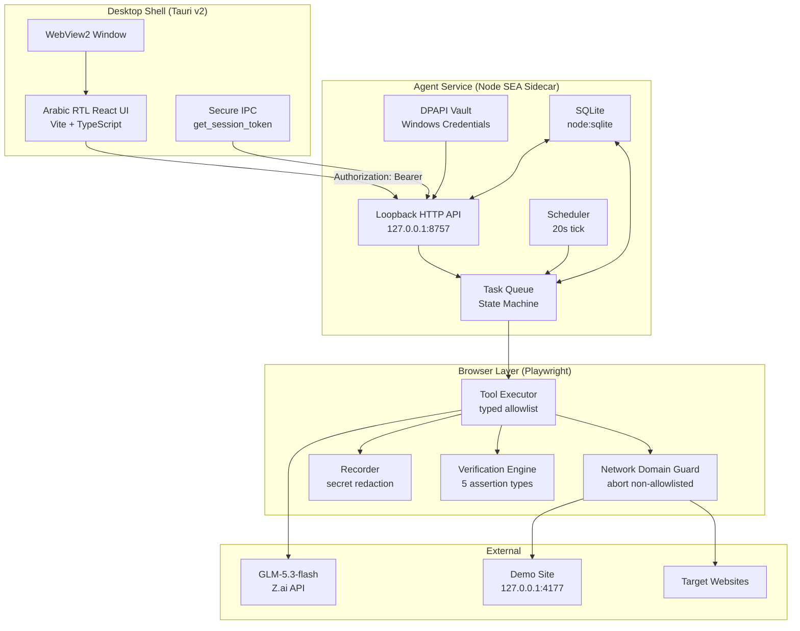
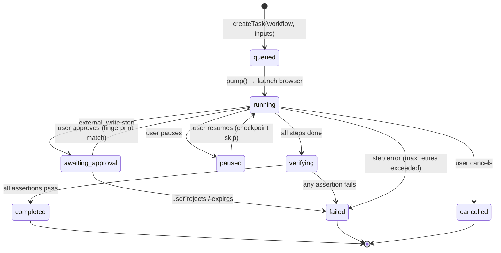
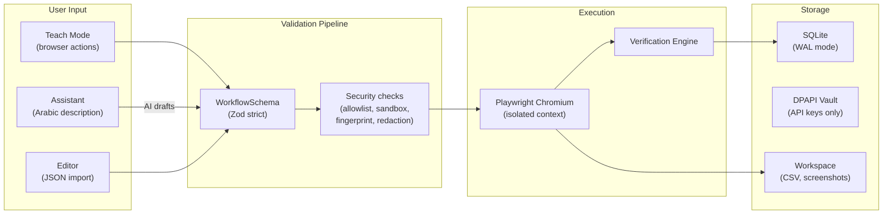
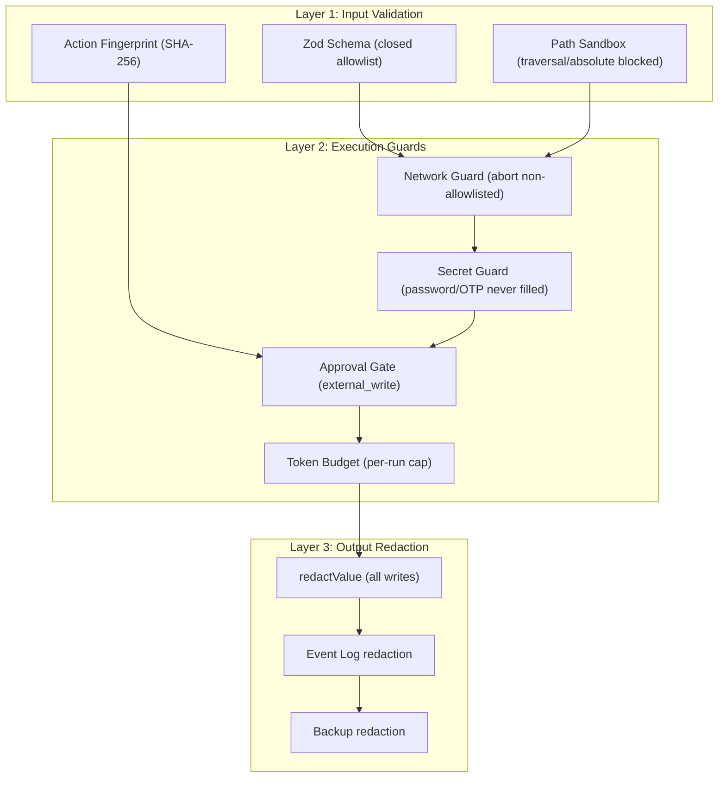

# AI Repeat — Architecture & Diagrams

## System Architecture

```mermaid
graph TB
    subgraph "Desktop Shell (Tauri v2)"
        UI["Arabic RTL React UI<br/>Vite + TypeScript"]
        IPC["Secure IPC<br/>get_session_token"]
        WEBVIEW["WebView2 Window"]
    end

    subgraph "Agent Service (Node SEA Sidecar)"
        API["Loopback HTTP API<br/>127.0.0.1:8757"]
        QUEUE["Task Queue<br/>State Machine"]
        SCHED["Scheduler<br/>20s tick"]
        VAULT["DPAPI Vault<br/>Windows Credentials"]
        STORE["SQLite<br/>node:sqlite"]
    end

    subgraph "Browser Layer (Playwright)"
        GUARD["Network Domain Guard<br/>abort non-allowlisted"]
        EXEC["Tool Executor<br/>typed allowlist"]
        REC["Recorder<br/>secret redaction"]
        VERIFY["Verification Engine<br/>5 assertion types"]
    end

    subgraph "External"
        MODEL["GLM-5.3-flash<br/>Z.ai API"]
        FIXTURE["Demo Site<br/>127.0.0.1:4177"]
        TARGET["Target Websites"]
    end

    WEBVIEW --> UI
    UI -->|"Authorization: Bearer"| API
    IPC --> API
    API --> QUEUE
    QUEUE --> EXEC
    SCHED --> QUEUE
    EXEC --> GUARD
    GUARD --> FIXTURE
    GUARD --> TARGET
    EXEC --> REC
    EXEC --> VERIFY
    EXEC --> MODEL
    VAULT --> API
    STORE <--> API
    STORE <--> QUEUE
```

## Task Lifecycle

```mermaid
stateDiagram-v2
    [*] --> queued: createTask(workflow, inputs)
    queued --> running: pump() → launch browser
    running --> awaiting_approval: external_write step
    awaiting_approval --> running: user approves (fingerprint match)
    awaiting_approval --> failed: user rejects / expires
    running --> paused: user pauses
    running --> verifying: all steps done
    verifying --> completed: all assertions pass
    verifying --> failed: any assertion fails
    running --> failed: step error (max retries exceeded)
    running --> cancelled: user cancels
    paused --> running: user resumes (checkpoint skip)
    completed --> [*]
    failed --> [*]
    cancelled --> [*]
```

## Data Flow

```mermaid
flowchart LR
    subgraph "User Input"
        REC_UI["Teach Mode<br/>(browser actions)"]
        DESC_UI["Assistant<br/>(Arabic description)"]
        JSON_UI["Editor<br/>(JSON import)"]
    end

    subgraph "Validation Pipeline"
        SCHEMA["WorkflowSchema<br/>(Zod strict)"]
        SECURITY["Security checks<br/>(allowlist, sandbox,<br/>fingerprint, redaction)"]
    end

    subgraph "Execution"
        BROWSER["Playwright Chromium<br/>(isolated context)"]
        VERIFY["Verification Engine"]
    end

    subgraph "Storage"
        SQLITE["SQLite<br/>(WAL mode)"]
        DPAPI["DPAPI Vault<br/>(API keys only)"]
        WORKSPACE["Workspace<br/>(CSV, screenshots)"]
    end

    REC_UI --> SCHEMA
    DESC_UI -->|"AI drafts"| SCHEMA
    JSON_UI --> SCHEMA
    SCHEMA --> SECURITY
    SECURITY --> BROWSER
    BROWSER --> VERIFY
    VERIFY --> SQLITE
    BROWSER --> WORKSPACE
```

## Security Layers

```mermaid
flowchart TB
    subgraph "Layer 1: Input Validation"
        SCHEMA["Zod Schema (closed allowlist)"]
        PATH_SANDBOX["Path Sandbox (traversal/absolute blocked)"]
        FINGERPRINT["Action Fingerprint (SHA-256)"]
    end

    subgraph "Layer 2: Execution Guards"
        NETWORK_GUARD["Network Guard (abort non-allowlisted)"]
        SECRET_GUARD["Secret Guard (password/OTP never filled)"]
        APPROVAL_GATE["Approval Gate (external_write)"]
        BUDGET["Token Budget (per-run cap)"]
    end

    subgraph "Layer 3: Output Redaction"
        REDACT["redactValue (all writes)"]
        LOG_REDACT["Event Log redaction"]
        BACKUP_REDACT["Backup redaction"]
    end

    SCHEMA --> NETWORK_GUARD
    PATH_SANDBOX --> NETWORK_GUARD
    FINGERPRINT --> APPROVAL_GATE
    NETWORK_GUARD --> SECRET_GUARD
    SECRET_GUARD --> APPROVAL_GATE
    APPROVAL_GATE --> BUDGET
    BUDGET --> REDACT
    REDACT --> LOG_REDACT
    LOG_REDACT --> BACKUP_REDACT
```
